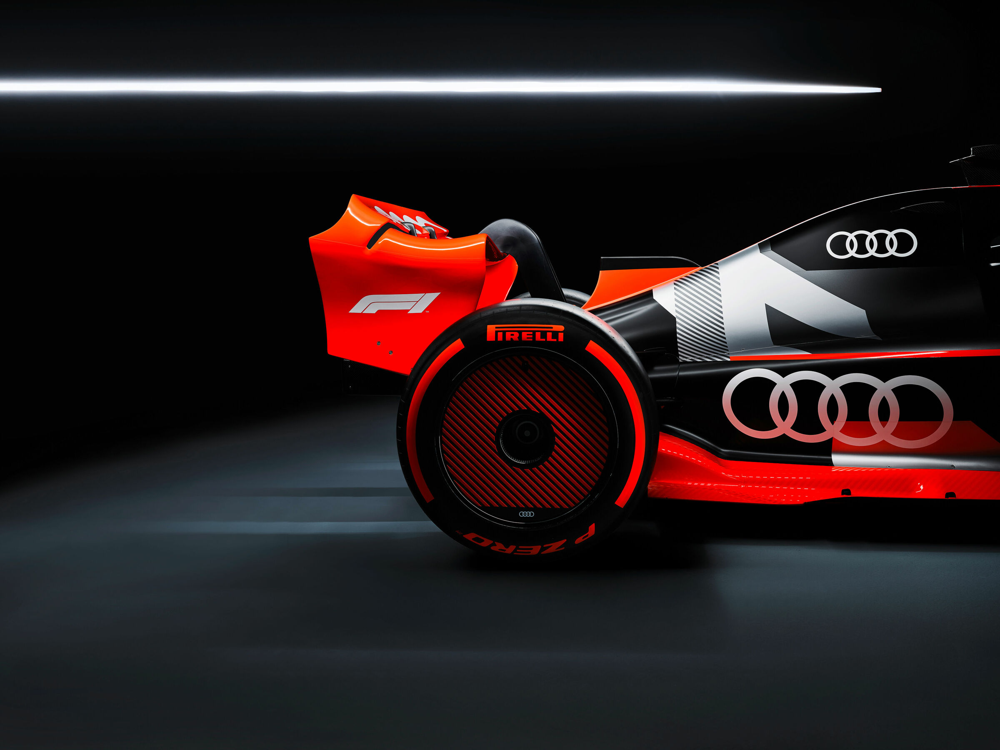
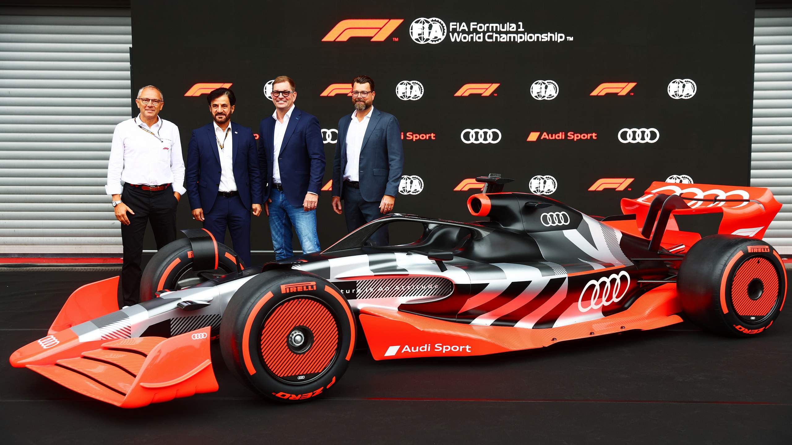
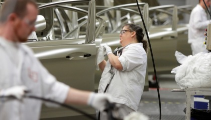
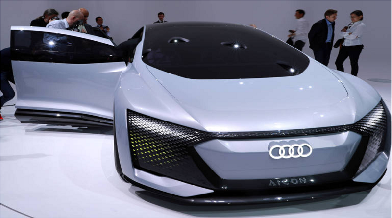

# ESPORTE

# ESCOLA: GILDO VERÍSSIMO
# DISCIPLINA: LÍNGUA PORTUGUÊS
# PROFESSOR: MARCOS
# ALUNO: SIL FARNEY 
# TURMA: 8°B
# TURNO: MANHÃ
---
---

# ALTOMOBILISMO
---

# Audi entrará na Fórmula 1 a partir de 2026
---

 
---
Fabricante alemã afirmou que revelará até o final do ano qual equipe deve ser sua parceria na categoria

---
Logo da Audi durante evento de automóveis em Bangcoc, Tailândia
Logo da Audi durante evento de automóveis em Bangcoc, Tailândia
22/03/2022 REUTERS/Athit Perawongmetha
Jan Schwartzda Reuters

---

A Audi entrará na Fórmula 1 a partir de 2026 como colaboradora de uma das equipes existentes no campeonato e usando um novo motor a ser construído na Alemanha, anunciou a empresa nesta sexta-feira (26).

---
A marca premium de propriedade da Volkswagen disse que revelará até o final do ano qual equipe será parceira no início de uma nova e mais sustentável era para o esporte.

---

PUBLICIDADE
---

A Audi está em negociações com o Sauber Group, com sede na Suíça, cuja equipe compete sob o nome Alfa Romeo, segundo relatos da Reuters e outros meios de comunicação.

---

“A Fórmula 1 é tanto um palco global para nossa marca quanto um laboratório de desenvolvimento altamente desafiador”, disse o presidente da Audi, Markus Duesmann, em um comunicado que coincidiu com uma entrevista coletiva em Spa-Francorchamps, na Bélgica.

---
A Fórmula 1 terá novos motores a partir de 2026 com foco na sustentabilidade e em um futuro mais econômico. A categoria de propriedade da Liberty Media estabeleceu a meta de ser neutra em carbono até 2030.

---
As novas regras também trarão maior eletrificação e uso de combustível sustentável avançado, com os fabricantes de motores também sujeitos a um teto de custo a partir da próxima temporada.

---

As operações de motores da Audi serão baseadas em Neuburg an der Donau, perto da sede da montadora em Ingolstadt, na Alemanha, com uma subsidiária separada da Audi Sport sendo fundada para o projeto.

---
A Porsche, outra marca do Grupo Volkswagen, também deve entrar na Fórmula 1 em 2026 em parceria com os atuais líderes do campeonato, a Red Bull.

---
A Audi foi 13 vezes vencedora das 24 Horas de Le Mans antes de abandonar a competição em 2017 e a marca tem um pedigree que remonta às corridas pré-Segunda Guerra Mundial como Auto Union.

---
A companhia continuará a competir no Rally Dakar, anualmente realizado na Arábia Saudita, com um protótipo elétrico, além de corridas de clientes com carros GT.

---
---
 
---
---

# Crise energética deve afetar produção de carros alemães para o exterior, diz associação
---
 
---
Produtividade deve cair mais de 8% no segundo semestre de 2022, segundo dados da Associação da Indústria Automotiva da Alemanha

---

Um levantamento feito pela Associação da Indústria Automotiva da Alemanha (VDA), a pedido da CNN, mostra que a produção de carros alemães para o exterior deve encolher mais de 8% no segundo semestre de 2022.

---
Na prática, o número de veículos comercializados para outros países deve cair de 9,5 milhões para 8,7 milhões nos próximos meses do ano.

---

PUBLICIDADE
---

A análise da VDA também mostra uma queda na produção para o mercado interno. Ao todo, a expectativa é que 3,3 milhões de automóveis sejam produzidos para o consumo dos próprios alemães ainda em 2022, valor 2% menor do que o projetado no início do ano.

---

“Os principais fornecedores nacionais e internacionais do setor automotivo fazem parte das indústrias que mais consumem gás na Alemanha e no mundo. É importante que a Alemanha continue a trabalhar em conjunto para reduzir a sua dependência do gás russo. A indústria automóvel está consciente da sua responsabilidade social e está determinada a dar o seu contributo para a redução do consumo de gás”, destaca um trecho do comunicado da VDA para a CNN.

---
A frota dos caminhões alemães será a mais impactada com a medida, segundo a VDA, já que esses veículos possuem as cadeias produtivas mais dependentes do gás natural russo.

---

Para Christiano Arrigoni, pesquisador e professor de economia do Ibmec, a medida pode gerar uma alta no preço dos automóveis no mundo. Isso porque ele aponta a indústria automobilística como um oligopólio, onde poucas empresas detêm grande parcela do mercado.

---
Atualmente, a Alemanha responde por uma grande parcela do setor automobilístico do mundo. O país é a sede de empresas como Porsche, BMW, Mercedes-Benz e Audi.

---
“Nesse setor, nós podemos ver claramente uma criação de oligopólio, tendo a Alemanha uma grande força na manutenção desse mercado. Vai diminuir a produção, de forma nacional e internacional. Se não houver recuo de demanda por carros, então é possível que o preço aumente dos produtos alemães. Podemos presenciar isso no Brasil, país dependente desses automóveis”, disse o professor do Ibmec.

---

