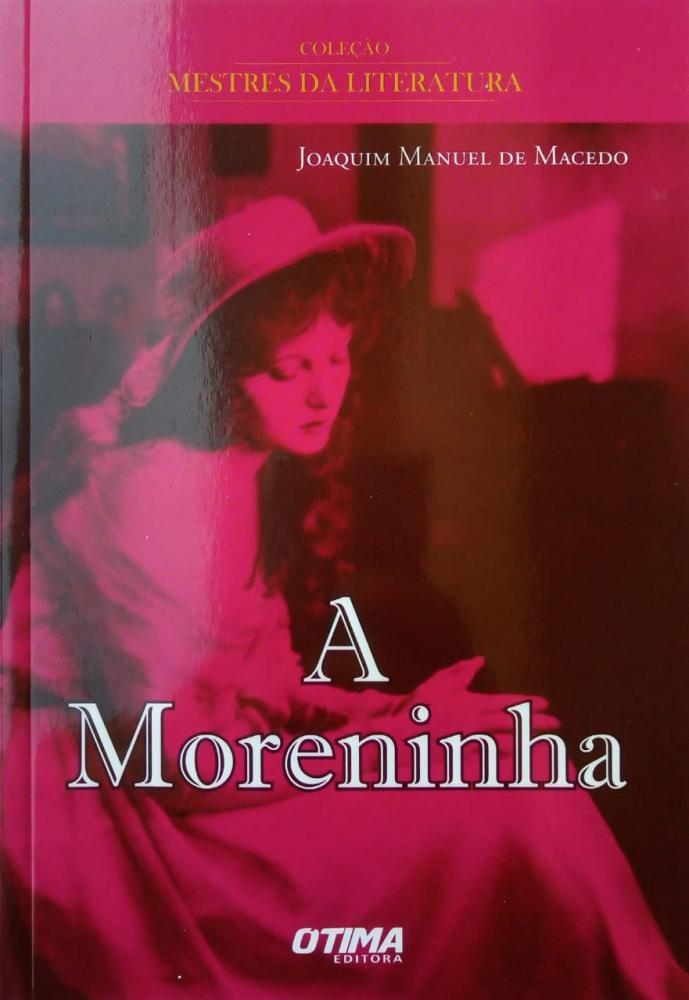

# O LIVRO A MORENINHA

# ESCOLA: GILDO VERÍSSIMO
## DISCIPLINA: LÍNGUA PORTUGUESA
## PROFESSOR: MARCOS
## ALUNO: SIL FARNEY
## TURNO: MANHÃ
## TURMA: 8°B
---
---

# RESUMO
---

A Moreninha é um romance de Joaquim Manuel de Macedo, publicada em 1844. 

---

Conheça a primeira obra do romantismo brasileiro por meio do nosso resumo do livro A Moreninha de Joaquim Manuel de Macedo (1820-1882). Obra de 1844 que teve um forte impacto na cultura da época.

---

Vamos então começar o nosso resumo do livro A Moreninha de Joaquim Manuel de Macedo. É uma história e tanto, você vai gostar de conhecer.

---

Resumo do livro A Moreninha de Joaquim Manuel de Macedo
Somos apresentados a 4 jovens estudantes de medicina: Felipe, Augusto, Fabrício e Leopoldo.

---

Felipe, Augusto, Fabrício e Leopoldo no resumo do livro A moreninha
Felipe tem uma avó chamada Dona Ana que vive em uma ilha próxima ao Rio de Janeiro. Ele convida seus amigos para aproveitarem a festa de Sant’Ana lá, na casa dela. Inicialmente Augusto recusa, não quer viajar com os amigos, mas é incentivado a aceitar por pressão de uma aposta.

---

A aposta de Filipe é que os amigos irão se interessar por suas primas e pelas amigas delas. São elas: Joaninha, Quinquina e suas amigas, Gabriela e Clementina. Há ainda Carolina, irmã de Filipe e uma das personagens principais que destacamos neste resumo do livro A Moreninha de Joaquim Manuel de Macedo.

---

Especialmente Augusto é desafiado a não se apaixonar por nenhuma mulher por mais de 15 dias. Ele aceita a aposta e se não conseguisse vencer, escreveria um romance contando sua paixão. Sua fama era a de um jovem namorador e inconstante no amor. Seus relacionamentos nunca duravam muito.

----

Na ilha ele conhece Carolina, a moreninha, irmã de Felipe, e começa a se envolver com ela.

---

O que é o mito da caverna?
Início do conflito – A paixão da infância
Augusto e Carolina em A Moreninha de Joaquim Manuel de Macedo
Perturbado por uma discussão à mesa com os amigos e desprezado pelas moças que descobriram que ele era inconstante, Augusto se junta à Dona Ana, a avó de Carolina. Ela era uma amável senhora de sessenta anos, e ouviu o desabafo de Augusto. Eles estavam em uma gruta e ele explicou porque era inconstante no amor. Carolina estava escutando, mas ele não sabia.

---

Disse que quando era criança, se apaixonou por uma menina que ele conheceu na praia. Os dois haviam ajudado um pobre velho moribundo que, agradecido, profetizou o casamento dos dois no futuro. Este idoso até mesmo os casou simbolicamente, por meio de uma troca de presentes.

---

Este episódio é um dos mais marcantes que ressaltamos neste resumo do livro A Moreninha de Joaquim Manuel de Macedo.

---

O homem deu a Augusto o botão de esmeralda da menina, envolvido numa fita branca e deu à menina o camafeu de Augusto, envolvido numa fita verde. Eles nunca revelaram seus nomes e se despediram como “meu marido” e “minha esposa”.

---

Augusto diz também que jurou lealdade a essa menina e por isso não poderia ter nenhuma outra.

---

Nessa conversa com Dona Ana ele ouve a lenda que envolve a água que há na gruta, que é dita ser milagrosa. Quem dela bebia adivinhava os segredos dos outros.

---

A lenda que envolve a água da gruta
Reza a lenda que uma bela índia tamoia não era notada por seu amado. Desprezada, ela perde a alegria de viver, pois estava cansada de ser ignorada. Muito triste ela chorou sobre o rochedo até formar uma fonte.

---

O índio tendo ido dormir na gruta, bebeu das lágrimas dela e a percebeu no rochedo, ouviu seu canto e, por fim, se apaixonou.

---

Augusto volta nesta fonte com as quatro moças para se declarar a uma delas e finge adivinhar seus segredos a partir do que tinha bisbilhotado de cada uma. Porém, Carolina bebe também e começa a contar os segredos de Augusto, indo embora antes dele se declarar.

---

O camafeu de Augusto entregue por Carolina em A moreninha
Questões de vestibular sobre Vidas Secas
CONCLUSÃO do resumo do livro A Moreninha de Joaquim Manuel de Macedo
Resumo de A moreninha de Manuel de Macedo
O período da festa de Sant’Ana passa e ele volta a cidade sem conseguir se esquecer de Carolina. Eles mantém encontros, mas o pai o proíbe de voltar a vê-la porque acha que os estudos estão sendo afetados. Sua intenção é que o filho fique estudando, trancado no quarto.

----

A tristeza de Augusto foi tão grande que ele caiu doente e o pai atendeu à sua vontade.

---

Augusto voltou à Ilha para se declarar a Carolina. Ela o testa e lhe recorda a promessa que tinha feito na infância, junto ao leito do velho moribundo.

---

Repreende-o por quebrar a promessa a quem ele um dia chamou de “sua mulher”. Angustiado, ele a contesta, afirmando se tratar de um juramento do tempo da infância e que desconhecia o paradeiro da menina.

---

Ainda assim, ficou confuso e preocupado, até que Carolina mostrou o seu camafeu. O mistério é desfeito, e, para pagar a aposta, Augusto escreve o livro A Moreninha para contar como encontrou, casou-se e foi feliz com sua amada.

---

Questões de vestibular sobre a Primeira Guerra
Análise do livro A Moreninha de Joaquim Manuel de Macedo
o primeiro romance brasileiro A Moreninha
Esta é uma belíssima obra de romantismo exagerado, com muita carga sentimental. São 23 capítulos e um epílogo em A Moreninha, que juntos são o início da ficção do romantismo brasileiro.

----

Romance folhetim
Este nome foi dado por ter atendido ao gosto do leitor da época, retratando bem o cotidiano e a cultura da juventude carioca.

---

Ressaltamos neste resumo do livro A Moreninha de Joaquim Manuel de Macedo, que somos apresentados aos costumes e à organização daquela sociedade em formação no século XIX no Rio de Janeiro.

---

Notamos elementos típicos como os estudantes de medicina, os bailes, a tradição da festa de Sant’Ana, o flerte das moças etc.

---

Acrescente-se a isso a idealização do amor puro, que nasce na infância e permanece apesar do tempo. É um ideal amoroso, não há traição, nem adultério.

---

Essa pureza é uma das principais características que enquadram a obra como romântica.

----

Além disso seu enredo envolve:
---

Namoro difícil
Comicidade
Dúvida entre desejo e dever
Revelação surpreendente
Linguagem em tom coloquial
Amor “açucarado”
Um pouco de suspense
Final feliz
Aspectos técnicos
A narração se dá em terceira pessoa e o narrador é do tipo onisciente. Porém há momentos em que o narrador é Augusto, pois é ele quem relata a aposta que fez com Filipe. Vale ressaltar que o narrador é intrometido em alguns momentos da história.

---

Esse tipo de narrador nos ajuda a ter uma compreensão mais aprofundada dos aspectos psicológicos das personagens, já que descreve também como se sentem, o que pensam, seus conflitos, etc.

---

Durante a leitura do resumo do livro A moreninha de Joaquim Manuel de Macedo, deve ter sido possível perceber que os ambientes são nacionais.

---

O tempo usado por Joaquim Manuel de Macedo foi o cronológico. Todo o acontecimento retratado em A Moreninha ocorre em três semanas e meia.

---

Tudo acontece no Rio de Janeiro e na ilha próxima a ele. Essa tal ilha paradisíaca, onde o romance se passa, se encontra à uma pequena distância do Rio de Janeiro.

---

A história causa a impressão de acontecer no durante a leitura, como que simultaneamente, pois há muitos diálogos entre as personagens.

---

Personagens principais: Felipe, Augusto, Carolina (a moreninha), Fabrício, Leopoldo e Dona Ana.

---

Curiosidades destaques deste resumo do livro A moreninha de Joaquim Manuel de Macedo:
A obra possui adaptação para o cinema a para a novela. A Moreninha foi adaptada para cinema em dois momentos: 1915 e 1970. E não parou por aí, o romance também inspirou a criação de duas telenovelas, uma que estreou em 1965 e outra, em 1975.
Confira o trailer:

O nome da ilha não é dito na obra, porém a descrição da ilha e alguns dados de sua biografia levam a crer que se trata da ilha de Paquetá. O romance e o escritor foram tão importantes e o impacto da obra foi tão grande para a ilha de Paquetá, que uma de suas praias recebeu justamente o nome de “Moreninha”.

---

A cultura nacional se fez também presente em relação às origens indígenas, através da lenda da gruta. Como vimos no resumo do livro A Moreninha de Joaquim Manuel de Macedo, o choro de uma índia que se apaixonou por um índio e não foi correspondida se transformou na fonte que corre na gruta.
Ilha de Paqueta no Resumo e Análise de A Moreninha
Esperamos ter ajudado com essa análise do livro A Moreninha de Joaquim Manuel de Macedo. Seu feedback é muito importante. Diga pra gente o que achou.

---
---

